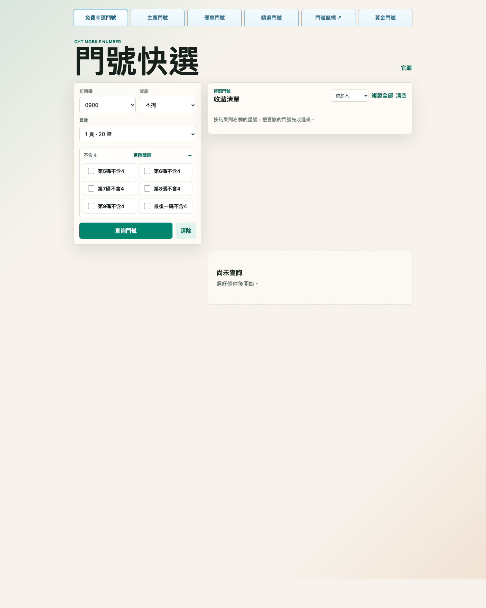
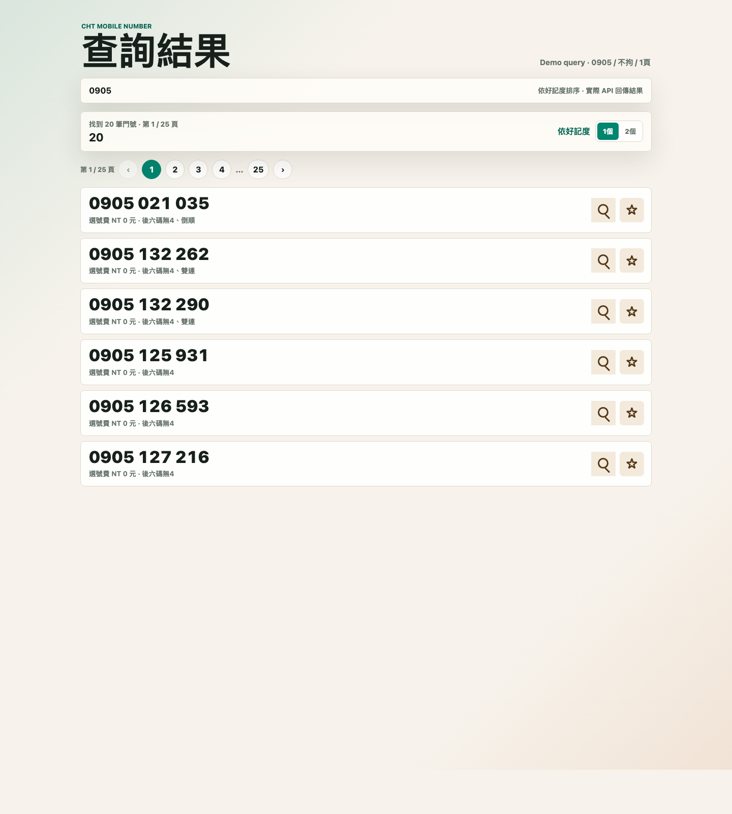
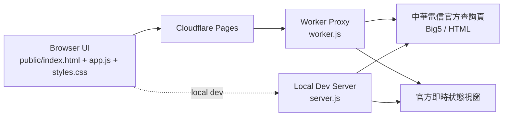

# 中華電信門號快選

<p>
  <a href="https://github.com/WaterGGAI/cht-number-picker/blob/main/LICENSE"></a>
  <a href="https://cht-number-picker.pages.dev"></a>
  <a href="https://github.com/WaterGGAI/cht-number-picker/actions/workflows/ci.yml"></a>
  
  
</p>

一個替中華電信門號查詢頁做的手機友善介面。它會代理官方 Big5 頁面，把原本偏桌機、偏舊式的查詢流程整理成比較適合手機與快速篩選的門號清單，同時保留官方「即時狀態與申租限制」視窗。

正式站：[https://cht-number-picker.pages.dev](https://cht-number-picker.pages.dev)

## 快速 Demo

- 直接使用正式站：[cht-number-picker.pages.dev](https://cht-number-picker.pages.dev)
- 手機友善首頁：前四碼、查詢方式、頁數、進階篩選集中在首屏
- 主題門號快選：保留官方分類，不把所有主題號碼混成一大串
- 門號即時查：每筆結果都能開官方狀態視窗

<p align="center">
  
  
</p>

<p align="center">
  
</p>

## 為什麼做這個

官方查詢頁可以用，但在手機上操作很吃力，資訊密度也不太適合快速掃描。這個專案的目標不是取代官方流程，而是把「找門號」這段體驗整理得更順：

- 更好的手機版佈局
- 更清楚的查詢條件
- 更好掃描的結果列表
- 保留官方預約與即時狀態流程

## 功能

### 查詢能力

- 支援前四碼、不拘、後六碼、特殊號碼費、各位置不含 4
- 後六碼查詢用 `x` 代表任意數字，例如 `58xx58`
- 4 個 `x` 會自動拆成 10 組官方允許的查詢並合併結果
- 5 個以上 wildcard 不支援，避免過度查詢官方站
- 可選擇抓 1、3、5 頁官方結果，每頁 20 筆

### 結果體驗

- 查詢結果可切換一排 1 個 / 一排 2 個
- 可依好記度或號碼排序
- 可收藏待選門號，支援一鍵複製、匯出、匯入
- 放大鏡按鈕可開啟官方「號碼即時狀態與申租限制」視窗
- 會記住最近一次查詢條件，手機重開後不用重選

### 快選與分類

- 實作官方六個快選入口
- 主題門號保留官方分類切換
- 主題門號目前可分為：
  `一路發`、`三星彩`、`雙雙對對`、`四星彩`、`88專區`、`長長99`、`44如意`、`步步高升`

## 架構



### 核心設計

- 正式環境由 Cloudflare Pages + Worker 提供靜態頁面與代理查詢
- 本機開發時使用 `server.js` 模擬相同流程
- `lib/cht-core.cjs` 集中處理 Big5 回應解析、查詢驗證、分頁與 official URL rewrite
- Worker / server 只保留各自的 session 與 HTTP 邊界

## 本機開發

需求：

- Node.js 20+

安裝依賴：

```bash
npm install
```

啟動：

```bash
npm start
```

開啟 [http://localhost:5173](http://localhost:5173)。

健康檢查：

```bash
curl http://localhost:5173/api/health
```

## 部署到 Cloudflare Pages

```bash
npm run deploy:cf
```

部署前檢查：

```bash
npm test
npm run check:cf
```

## 專案結構

- [public/index.html](public/index.html)
- [public/favicon.svg](public/favicon.svg)
- [public/manifest.webmanifest](public/manifest.webmanifest)
- [public/sw.js](public/sw.js)
- [public/app.js](public/app.js)
- [public/app-logic.js](public/app-logic.js)  
  Frontend pure helpers for sorting, pagination, pattern normalization, quick-link snapshot state, and saved search drafts.
- [public/styles.css](public/styles.css)
- [lib/cht-core.cjs](lib/cht-core.cjs)
- [scripts/prepare-pages.mjs](scripts/prepare-pages.mjs)
- [worker.js](worker.js)
- [server.js](server.js)
- [wrangler.jsonc](wrangler.jsonc)

## Contributing

歡迎一起改這個專案。開始前可以先看 [CONTRIBUTING.md](CONTRIBUTING.md)。

最重要的原則只有幾個：

- 保留官方流程，不把預約與即時狀態流程本地化
- 避免高頻或批量查詢，尊重官方站負載
- UI 調整優先考慮手機體驗
- 前端 / Worker / 本機 server 的行為盡量保持一致

## Roadmap

### 已完成

- [x] 手機友善首頁與查詢條件面板
- [x] 官方六個快選入口
- [x] 主題門號分類切換
- [x] 門號即時狀態放大鏡
- [x] 收藏清單、匯入匯出與一鍵複製
- [x] 結果一排 1 個 / 2 個顯示切換
- [x] 4 個 `x` wildcard 拆查
- [x] 最近一次查詢條件自動恢復
- [x] Cloudflare Pages 正式部署
- [x] GitHub 開源與 README 截圖

### 下一步

- [x] README 補查詢結果截圖
- [ ] 補更完整的部署與環境說明
- [ ] 增加更多 UI 狀態驗證與回歸檢查
- [ ] 視需要補官方快選更多分類或排序一致性

## 注意

請避免自動大量查詢。官方頁面本身有同時查詢人數限制，這個工具只會在使用者操作時送出請求。

即時狀態視窗會沿用本次查詢的官方 session，約 30 分鐘後過期；預約與個資填寫仍是中華電信官方流程。
